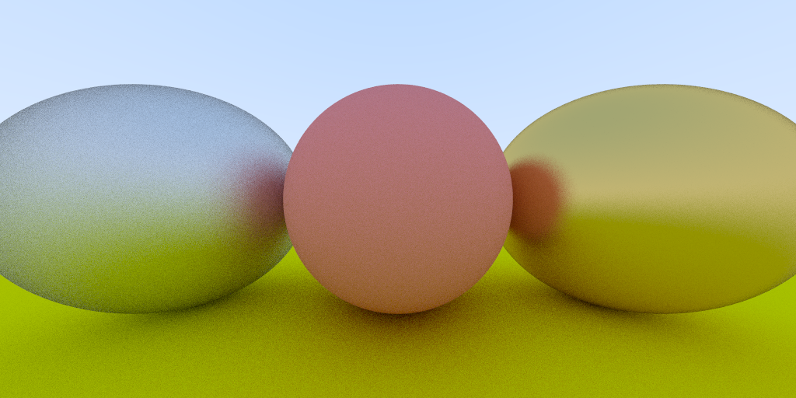
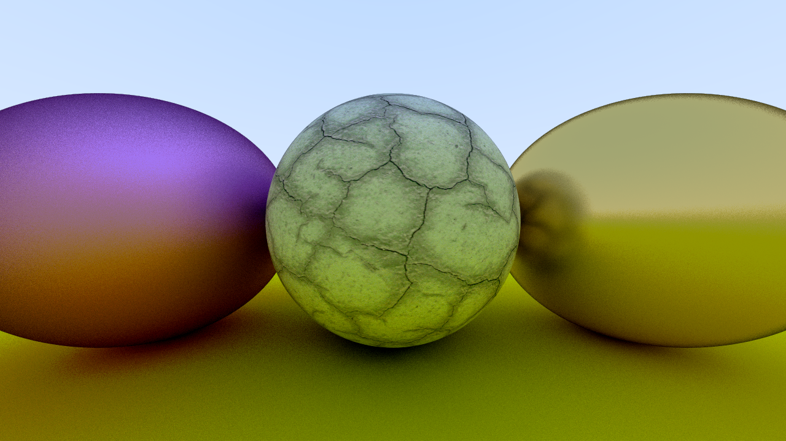

# My first raytracer

Raytracer v1:
* antialiasing
* Metalic material
* Lambertian material
* Multithreaded with OpenMP

Raytracer v1.2:
* Aperture + Focus on camera
* Optimizations
* Texture
* Transparency and refraction

# TODO
[Accelerating monte-carlo](http://www.ipol.im/pub/art/2015/119/)

